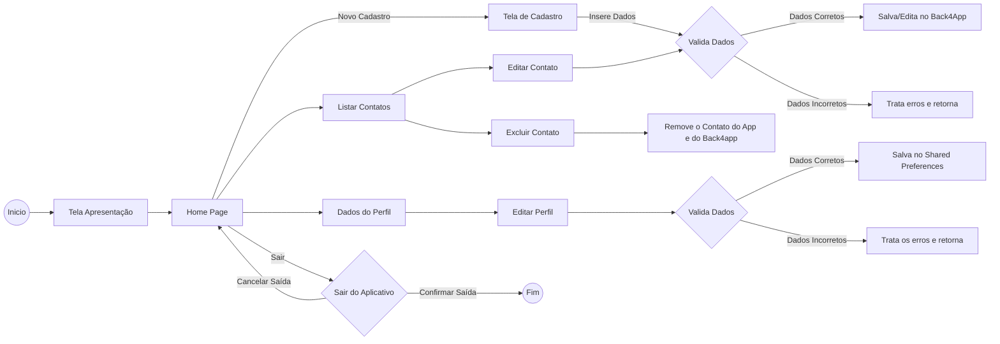

# Lista de Contatos em Flutter DIO
Projeto de lista de contatos em flutter - Bootcamp Santader DIO

## Requisitos:
<ol>
    <li>- [x] Criar uma aplicação Flutter​​​​</li>
    <li>- [x] Criar um banco de dados / Back4App​</li>
    <li>- [x] Fazer um cadastro de pessoa com foto de perfil​</li>
    <li>- [x] Salvar apenas o path da imagem na base de dados​​ ​</li>
    <li>- [x] Listar as pessoas em uma lista com sua respectiva foto​​ ​</li>
    <li>- [x] Usar os outros componentes aprendidos​ ​</li>
</ol>

## Fluxograma:

### Minhas redes sociais, conecte-se comigo:

### Um pouco do meu GitHub:

